<div align="center">


# ☁️ AWS Cloud & DevOps — Scenario-Driven Notes

[](https://aws.amazon.com)
[](#)
[](#)
[](#)
[](#)

<br/>

> 🏙️ **By Akshay Sawant** — AWS DevOps Engineer · AWS Solutions Architect Associate · Pune, Maharashtra

[](#)
[](#)
[](#)
[](#)

</div>

---

## 📚 Table of Contents

<div align="center">

| # | Topic | Concepts Covered |
|:---:|:---|:---|
| [01](#-01--cloud-service-models) | ☁️ Cloud Service Models | IaaS · PaaS · SaaS · Serverless · Virtualization |
| [02](#-02--how-the-internet-works--dns) | 🌐 How the Internet Works & DNS | URL parsing · DNS · TCP · TLS · HTTP |
| [03](#-03--tcpip-model--osi-model) | 🔌 TCP/IP & OSI Model | 4 Layers · 7 Layers · TCP vs UDP · Encapsulation |
| [04](#-04--aws-nat-gateway) | 🔐 AWS NAT Gateway | SNAT · PAT · Packet Flow · Use Cases |
| [05](#-05--vpc-fundamentals) | 🏗️ VPC Fundamentals | CIDR · Subnets · IGW · Route Tables · RFC1918 |
| [06](#-06--security-groups--nacls) | 🛡️ Security Groups & NACLs | SG vs NACL · ENI · SG Referencing · Stateful/Stateless |
| [07](#-07--aws-rds-deep-dive) | 🗄️ AWS RDS Deep Dive | Multi-AZ · Read Replicas · PITR · Encryption · Proxy |
| [08](#-08--amazon-elasticache) | ⚡ Amazon ElastiCache | Redis · Memcached · Cache Hit/Miss · Eviction |
| [09](#-09--amazon-dynamodb) | 📦 Amazon DynamoDB | PK · SK · GetItem · Query · Scan · Design |
| [10](#-10--troubleshooting-scenarios) | 🔍 Troubleshooting Scenarios | EC2 · RDS · ECS · Lambda · Docker |
| [11](#-11--aws-cost-optimization) | 💰 AWS Cost Optimization | Right-sizing · Reserved · Spot · S3 Lifecycle |
| [12](#-12--interview-cheat-sheet) | 🎯 Interview Cheat Sheet | One-liners · Key commands · Quick answers |

</div>

---

## ☁️ 01 · Cloud Service Models

### The Responsibility Pyramid

```
                        ┌──────────────────────────────────────────────────────┐
                        │                 CLOUD MODELS                         │
                        │                                                      │
        YOU MANAGE  ─→  │   IaaS          PaaS          SaaS                  │
        ─────────────   │   ─────────     ─────────     ─────────             │
        Application  →  │   YOU    ✅     YOU    ✅     PROVIDER              │
        Runtime      →  │   YOU    ✅     PROVIDER      PROVIDER              │
        OS           →  │   YOU    ✅     PROVIDER      PROVIDER              │
        Network/Virt →  │   YOU    ✅     PROVIDER      PROVIDER              │
        Hardware     →  │   PROVIDER      PROVIDER      PROVIDER              │
                        └──────────────────────────────────────────────────────┘
```

### IaaS — Infrastructure as a Service

> 🎯 **Use only infrastructure. You manage everything above hardware.**

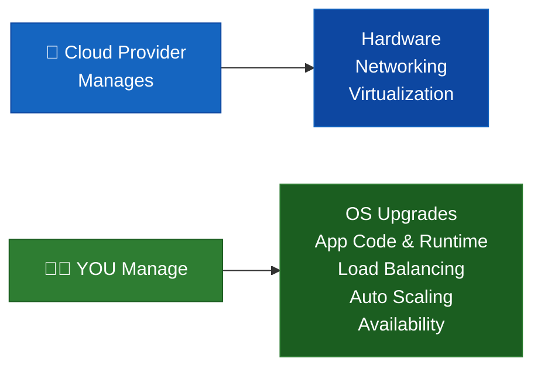

| Responsibility | IaaS | PaaS | SaaS |
|:---|:---:|:---:|:---:|
| Application Code | 👤 You | 👤 You | ☁️ Provider |
| Runtime | 👤 You | ☁️ Provider | ☁️ Provider |
| OS (Patches) | 👤 You | ☁️ Provider | ☁️ Provider |
| Load Balancing | 👤 You | ☁️ Provider | ☁️ Provider |
| Hardware | ☁️ Provider | ☁️ Provider | ☁️ Provider |

**Real Examples:**
- 🔷 **IaaS** → `Amazon EC2` `Azure VMs` `Google Compute Engine`
- 🔷 **PaaS** → `Azure App Service` `Amazon RDS` `Google App Engine`
- 🔷 **SaaS** → `Gmail` `Microsoft 365` `Google Docs` `Salesforce`

---

### ⚡ Serverless — The Game Changer

> **"Serverless ≠ No Servers. It means YOU don't worry about servers!"**

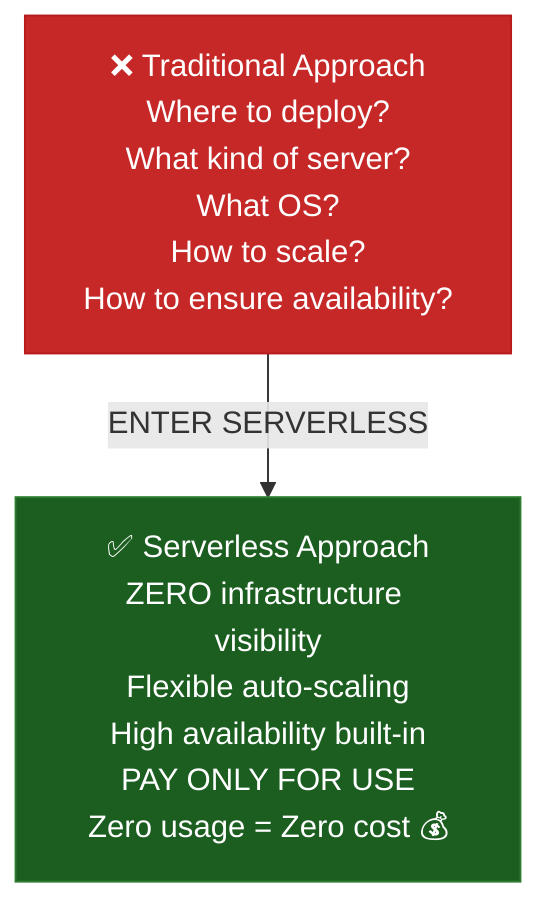

**Examples:** `AWS Lambda` · `AWS Fargate` · `Azure Functions` · `Cloud Run`

---

### 🖥️ Virtualization Basics

```
Physical Server
    │
    ├── Hypervisor (Software Layer)
    │       │
    │       ├── VM-1 [ OS + App A ]
    │       ├── VM-2 [ OS + App B ]
    │       └── VM-3 [ OS + App C ]
    │
    └── Benefits: Better Utilization · Cost Efficiency · Isolation · Flexibility
```

> 💡 **Foundation of everything in cloud:** Containers, Serverless functions, EC2 — ALL built on virtualization layers!

---

## 🌐 02 · How the Internet Works & DNS

### What happens when you type `www.google.com`?

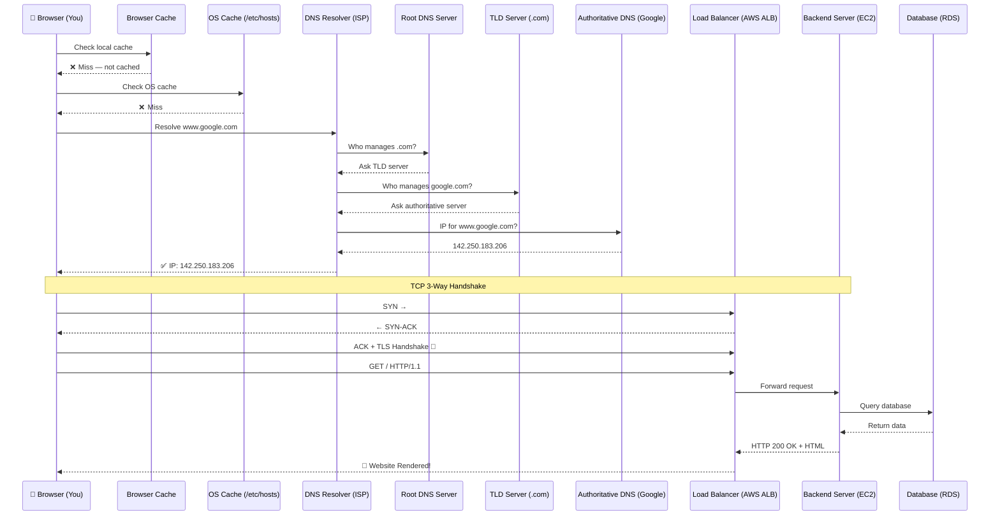

### ☁️ AWS Services at Each Step

| Internet Step | AWS Service | Purpose |
|:---|:---|:---|
| DNS Resolution | **Route 53** | Maps domain → IP |
| CDN / Edge | **CloudFront** | Serve static assets from nearest edge |
| Load Balancing | **ALB / NLB** | Distribute traffic to healthy backends |
| Compute | **EC2 / ECS / Lambda** | Run your application |
| Database | **RDS / DynamoDB** | Store & retrieve data |
| Cache | **ElastiCache** | Sub-millisecond reads |
| SSL/TLS Cert | **ACM** | Free managed certificates |

---

### 🔍 Website Not Loading — Layered Troubleshooting

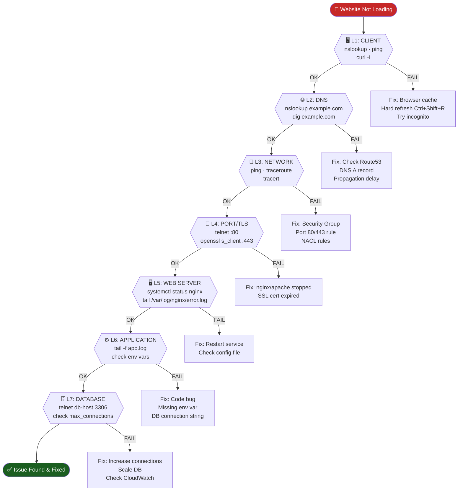

### HTTP Error Quick Reference

| Code | Meaning | Common Cause | Fix |
|:---:|:---|:---|:---|
| **404** | Not Found | Wrong URL / missing route | Check path, redeploy |
| **500** | Internal Server Error | App crash / unhandled exception | Check app logs |
| **502** | Bad Gateway | Backend server down | Check health checks |
| **503** | Service Unavailable | Server overloaded | Scale up / check ASG |

---

## 🔌 03 · TCP/IP Model & OSI Model

### TCP/IP — 4 Layers (Real-World Implementation)

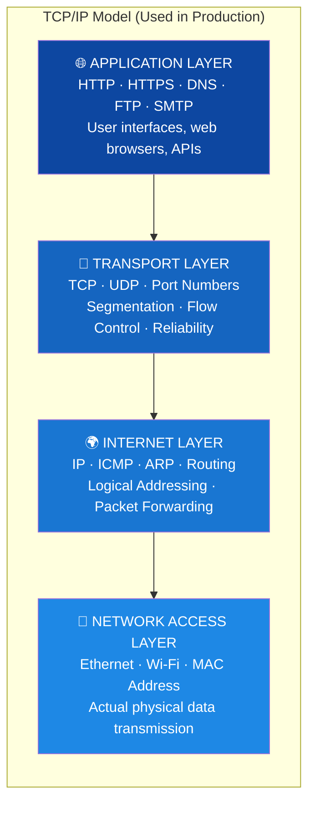

### OSI — 7 Layers (Conceptual Model for Troubleshooting)

```
Layer   │ Name          │ Key Protocols          │ Real-World Example
────────┼───────────────┼────────────────────────┼──────────────────────────────────
  7     │ Application   │ HTTP, HTTPS, DNS, FTP   │ Browser shows webpage
  6     │ Presentation  │ SSL/TLS, Encryption     │ HTTPS encryption, data compression
  5     │ Session       │ Session management      │ Login session, video call
  4     │ Transport     │ TCP, UDP, Ports         │ Data broken into segments with port
  3     │ Network       │ IP, ICMP, Routers       │ Routing packets between networks
  2     │ Data Link     │ Ethernet, MAC, Switches │ Frames between devices on same LAN
  1     │ Physical      │ Cables, WiFi, Signals   │ Electrical / radio waves
```

### Data Encapsulation Flow

```
Sending:                          Receiving:
App Data                          App Data
  ↓ + Transport Header             ↑ Strip Header
  Segment (TCP)                    Segment
  ↓ + IP Header                    ↑ Strip Header
  Packet (IP)                      Packet
  ↓ + MAC Header                   ↑ Strip Header
  Frame (Ethernet)                 Frame
  ↓ Convert to bits                ↑ Convert from bits
  Raw Bits (Physical)  ──────────→ Raw Bits
```

### ⚔️ TCP vs UDP — Full Comparison

| Feature | TCP 🔵 | UDP 🟠 |
|:---|:---:|:---:|
| Connection Type | Connection-Oriented | Connectionless |
| Reliability | ✅ Guaranteed delivery | ❌ Best-effort |
| Data Ordering | ✅ Always in order | ❌ No guarantee |
| Error Handling | ✅ Retransmission | ❌ None |
| Speed | 🐢 Slower | ⚡ Faster |
| Broadcasting | ❌ Not supported | ✅ Supported |
| Overhead | High | Low |
| **Use Cases** | HTTP, Email, DB, SSH | DNS, Video, Gaming, IoT |

> 💡 **Memory Trick:** TCP = **T**horoughly **C**hecked **P**ackets · UDP = **U**ndependable **D**elivery **P**rotocol

---

## 🔐 04 · AWS NAT Gateway

### The Real-World Problem

```
🏢 Organisation Scenario:
━━━━━━━━━━━━━━━━━━━━━━━━━━━━━━━━━━━━━━━━━━━━━━━━━━━━━━

Private Subnet (no internet)
  └── Backend EC2 (10.0.2.10)
        └── Backend App needs to download deps from GitHub ⚠️
              └── BUT... Private subnet has NO internet access!

SOLUTION → NAT Gateway!
━━━━━━━━━━━━━━━━━━━━━━━━━━━━━━━━━━━━━━━━━━━━━━━━━━━━━━
```

### NAT Gateway — Step-by-Step Packet Flow

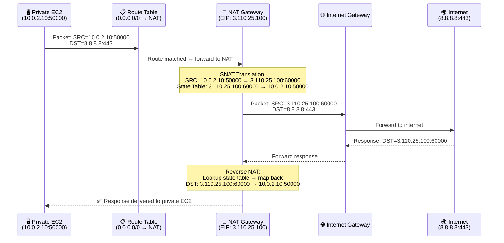

### When to Use NAT Gateway

| Scenario | Use Case |
|:---|:---|
| 🔧 App servers needing OS updates | `yum update` / `apt upgrade` from private subnet |
| 📦 Download packages | Pull from `npm`, `pip`, `Docker Hub`, `GitHub` |
| 🔗 External API calls | Payment gateways (Stripe, Razorpay) from private app servers |
| 🛡️ Security architecture | Keep backend servers private, controlled outbound only |
| ☸️ EKS Worker Nodes | Nodes in private subnet pulling container images |

```
Key Rules (Never Forget!):
  ✅ NAT works OUTBOUND only (Private → Internet)
  ❌ Internet CANNOT initiate connection to private EC2 via NAT
  ✅ NAT Gateway must be in PUBLIC subnet
  ✅ Private subnet route: 0.0.0.0/0 → NAT Gateway
  ✅ Elastic IP (static public IP) attached to NAT
```

---

## 🏗️ 05 · VPC Fundamentals

### CIDR — IP Addressing Made Simple

```
CIDR Block Sizes:
━━━━━━━━━━━━━━━━━━━━━━━━━━━━━━━━━━━━━━━━
  /32  =         1 IP   → Single host
  /28  =        16 IPs  → Very small subnet
  /24  =       256 IPs  → Standard subnet  ← MOST USED
  /22  =     1,024 IPs  → Medium network
  /16  =    65,536 IPs  → Full VPC range   ← AWS VPC default

Private IP Ranges (RFC 1918) — NOT routable on public internet:
━━━━━━━━━━━━━━━━━━━━━━━━━━━━━━━━━━━━━━━━
  10.0.0.0/8       → 10.0.0.0   – 10.255.255.255
  172.16.0.0/12    → 172.16.0.0 – 172.31.255.255
  192.168.0.0/16   → 192.168.0.0 – 192.168.255.255

⚠️ AWS reserves 5 IPs per subnet (first 4 + last 1)
   /24 = 256 IPs, but only 251 usable!
```

### Production 3-Tier VPC Architecture

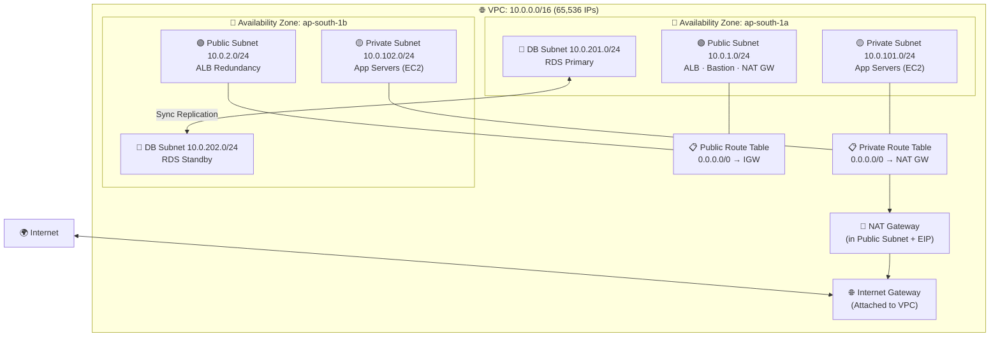

### Route Table Logic

| Destination | Target | Meaning |
|:---|:---|:---|
| `10.0.0.0/16` | `local` | Stay inside VPC — no gateway needed |
| `0.0.0.0/0` | `igw-xxxx` | All other traffic → Internet Gateway (public) |
| `0.0.0.0/0` | `nat-xxxx` | All other traffic → NAT Gateway (private) |

### Internet Gateway vs NAT Gateway

| Feature | 🌐 Internet Gateway | 🔐 NAT Gateway |
|:---|:---:|:---:|
| Inbound internet traffic | ✅ Allowed | ❌ Blocked |
| Outbound internet traffic | ✅ Allowed | ✅ Allowed |
| Used by subnet type | Public | Private |
| Requires Elastic IP | On EC2 instance | On NAT itself |
| Direction | Bidirectional | Outbound only |

---

## 🛡️ 06 · Security Groups & NACLs

### Traffic Flow Diagram

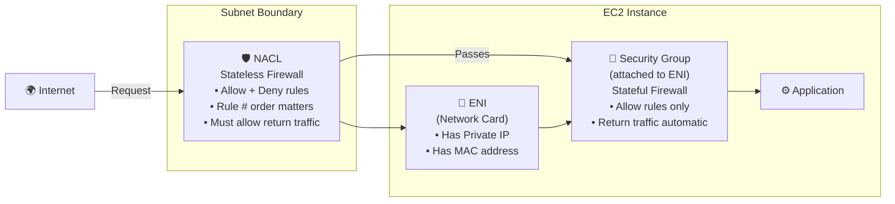

### SG vs NACL — Critical Comparison

| Feature | 🔐 Security Group | 🛡️ NACL |
|:---|:---|:---|
| Applied At | Instance level (ENI) | Subnet level |
| State | **Stateful** ✅ | **Stateless** ❌ |
| Rule Types | Allow ONLY | Allow + **Deny** |
| Rule Evaluation | All rules at once | In order (lowest # first) |
| Default (Custom) | Deny all inbound | Deny all |
| Return Traffic | Auto-allowed | Must explicitly allow |
| Best Use | Instance protection | Block bad IPs, subnet isolation |

### 🚨 NACL Stateless — Most Common Mistake!

```
NACL = STATELESS → You MUST allow BOTH directions!

Public Subnet NACL Example:
━━━━━━━━━━━━━━━━━━━━━━━━━━━━━━━━━━━━━━━━━━━━
INBOUND:
  Rule 100: Allow TCP 443 from 0.0.0.0/0    ✅ (HTTPS request comes IN)
  Rule 200: Allow TCP 80  from 0.0.0.0/0    ✅ (HTTP request comes IN)
  Rule *  : Deny ALL                         🚫 (implicit deny)

OUTBOUND:
  Rule 100: Allow TCP 1024-65535 to 0.0.0.0/0  ✅ (EPHEMERAL PORTS for response)
  Rule *  : Deny ALL                             🚫

❌ Forgetting ephemeral ports outbound = Users can't receive responses!
```

### SG Referencing — The Production Way

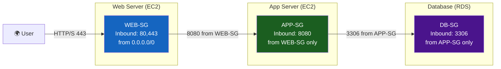

> **Why SG Referencing > IP Rules:**
> Auto Scaling adds 18 new EC2 instances → All automatically allowed (they share APP-SG)
> IP-based rules would break → You'd have to manually add 18 new IP rules!

### ENI Architecture

```
EC2 Instance
    │
    └── ENI-1 (Elastic Network Interface)
            ├── Private IP: 10.0.1.15
            ├── MAC Address: 0a:1b:2c:3d
            └── Security Groups: [WEB-SG, MONITORING-SG]  ← SG attaches HERE, not EC2!

Advanced: Multi-ENI EC2
    └── ENI-1 → Public Subnet (web traffic, WEB-SG)
    └── ENI-2 → Private Subnet (internal, INTERNAL-SG)
```

---

## 🗄️ 07 · AWS RDS Deep Dive

### RDS Features vs Traditional DB

| Feature | Traditional DB | Amazon RDS |
|:---|:---:|:---:|
| Setup | Manual (days) | ✅ Automated (minutes) |
| OS Patching | Manual | ✅ Managed |
| Backups | Manual scripts | ✅ Automated daily |
| High Availability | Complex setup | ✅ Multi-AZ toggle |
| Read Scaling | Manual replicas | ✅ Read Replicas |
| Monitoring | Install tools | ✅ CloudWatch built-in |
| Encryption | Configure manually | ✅ KMS checkbox |
| Cost | Hardware + ops | Pay-per-use |

### Multi-AZ vs Read Replicas — Most Asked Interview Question!

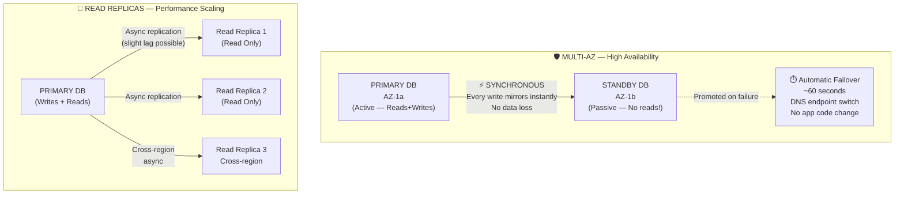

| Feature | 🛡️ Multi-AZ | 📖 Read Replica |
|:---|:---:|:---:|
| **Purpose** | High Availability | Read Scaling |
| **Replication** | Synchronous | Asynchronous |
| **Failover** | ✅ Automatic | ❌ Manual promotion |
| **Serves reads?** | ❌ No (standby) | ✅ Yes |
| **Data loss** | Near zero | Possible lag |
| **Use Case** | Production HA | Analytics, reporting |

### Point-in-Time Recovery (PITR) — Visual Timeline

```
PITR = Daily Snapshot + Continuous Transaction Logs

Timeline:
━━━━━━━━━━━━━━━━━━━━━━━━━━━━━━━━━━━━━━━━━━━━━━━━━━━━━━━━━━━━━
  Day 1          Day 2      Today 09:00   10:05 AM    10:30 AM
    │               │            │            │            │
    ▼               ▼            ▼            ▼            ▼
[📸 Snapshot]  [📸 Snapshot] [📸 Snapshot] [💥 BAD     [😱 YOU
                                            DELETE!]   NOTICE!]
                                                ↑
                              Restore to 10:04:59 AM ← ─ ─ ─ ─ ┘

How: RDS Console → Select DB → Actions → Restore to Point in Time
     ↓
Creates BRAND NEW DB instance (original untouched!)
RPO: seconds  |  RTO: minutes to hours (depends on DB size)
━━━━━━━━━━━━━━━━━━━━━━━━━━━━━━━━━━━━━━━━━━━━━━━━━━━━━━━━━━━━━
```

### Snapshot vs Automated Backup

| | 📸 Snapshot | 🔄 Automated Backup |
|:---|:---|:---|
| Trigger | Manual (you initiate) | AWS daily + continuous logs |
| PITR | ❌ Only that exact moment | ✅ Any second in window |
| Retention | Forever (until deleted) | 1–35 days |
| Cost | You pay for storage | Included up to DB size |
| Analogy | 📸 **Photo** | 🎥 **Video recording** |
| Best For | Before migrations, cloning | Disaster recovery, compliance |

### RDS Encryption

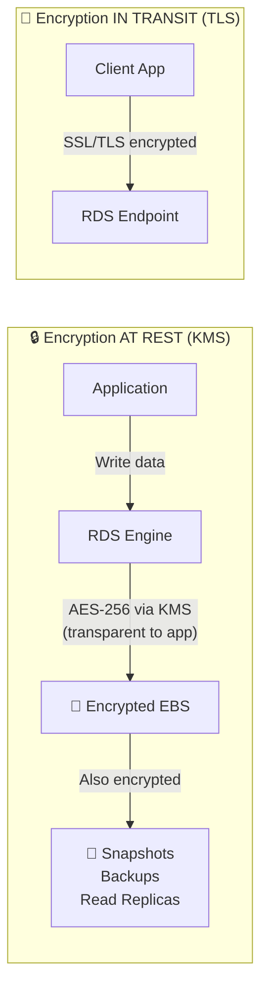

**⚠️ CRITICAL:** Encryption must be enabled **at DB creation time**!
Cannot encrypt an existing unencrypted DB directly.
**Workaround:** `Snapshot → Copy with encryption → Restore new encrypted DB`

### RDS Proxy — Fix for Short-Lived Connections

```
Problem: Serverless/Microservices create thousands of short-lived DB connections

Without Proxy:                    With RDS Proxy:
━━━━━━━━━━━━━━━━━━━━━━━━━━━━━━━━━━━━━━━━━━━━━━━━━━━━━
1000 Lambda requests              1000 Lambda requests
    ↓                                 ↓
1000 DB connections ❌            RDS Proxy (50 pooled connections) ✅
    ↓                                 ↓
DB CPU 100%                       DB CPU 20%
Connection refused                All requests served!

Benefits:
  🚀 Reduces connection overhead (no repeated TCP+TLS handshake)
  📉 Prevents connection exhaustion (max_connections)
  ⚡ Faster response time
  🔐 IAM authentication support
  🔄 Handles Multi-AZ failover automatically
```

### Amazon Aurora — AWS's Proprietary DB Engine

```
Regular RDS:     ┌─────────────────────┐
                 │  Compute (EC2)      │
                 │         +           │  ← Tightly coupled
                 │  EBS Storage        │
                 └─────────────────────┘

Amazon Aurora:   ┌─────────────────────┐
                 │  Compute Layer      │  ← Decoupled!
                 └──────────┬──────────┘
                            │
                 ┌──────────▼──────────────────────────────┐
                 │     Aurora Distributed Storage           │
                 │  6 copies across 3 AZs (auto)           │
                 │  Auto-scales up to 128 TB               │
                 │  Survives disk failure + AZ failure      │
                 └─────────────────────────────────────────┘

Performance: 5x faster than MySQL · 3x faster than PostgreSQL
Replicas:    Up to 15 read replicas
Failover:    ~30 seconds (vs minutes for standard RDS)
```

| Engine | Type | Aurora Compatible? |
|:---|:---:|:---:|
| MySQL | Open-source | ✅ Aurora MySQL |
| PostgreSQL | Open-source | ✅ Aurora PostgreSQL |
| MariaDB | Open-source | ❌ |
| Oracle | Licensed | ❌ |
| SQL Server | Microsoft | ❌ |
| **Aurora** | **AWS Proprietary** | **🌟 Native** |

---

## ⚡ 08 · Amazon ElastiCache

### Why Caching Matters

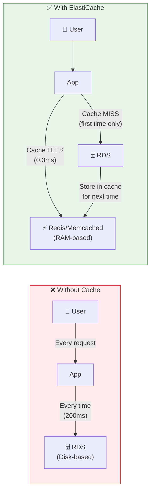

### Cache Hit vs Cache Miss Flow

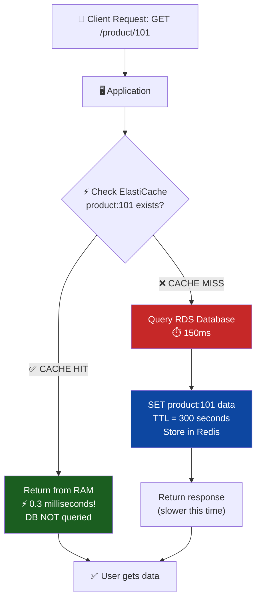

### Redis vs Memcached — Full Feature Comparison

| Feature | 🚀 Redis | ⚡ Memcached |
|:---|:---:|:---:|
| Data Structures | Strings · Lists · Sets · Hashes · Sorted Sets | Simple key-value only |
| Persistence | ✅ RDB snapshots + AOF | ❌ Memory only |
| Replication | ✅ Master–Replica | ❌ None |
| Pub/Sub | ✅ Yes | ❌ No |
| Transactions | ✅ MULTI/EXEC | ❌ No |
| Clustering | ✅ Redis Cluster (sharding) | ✅ Client-side only |
| Multi-threading | ❌ Single-threaded core | ✅ Multi-threaded |
| HA/Failover | ✅ Sentinel / Cluster | ❌ No |
| **Choose When** | Sessions · Leaderboards · Analytics · HA | Ultra-simple caching · Max throughput |

---

## 📦 09 · Amazon DynamoDB

### Relational vs NoSQL

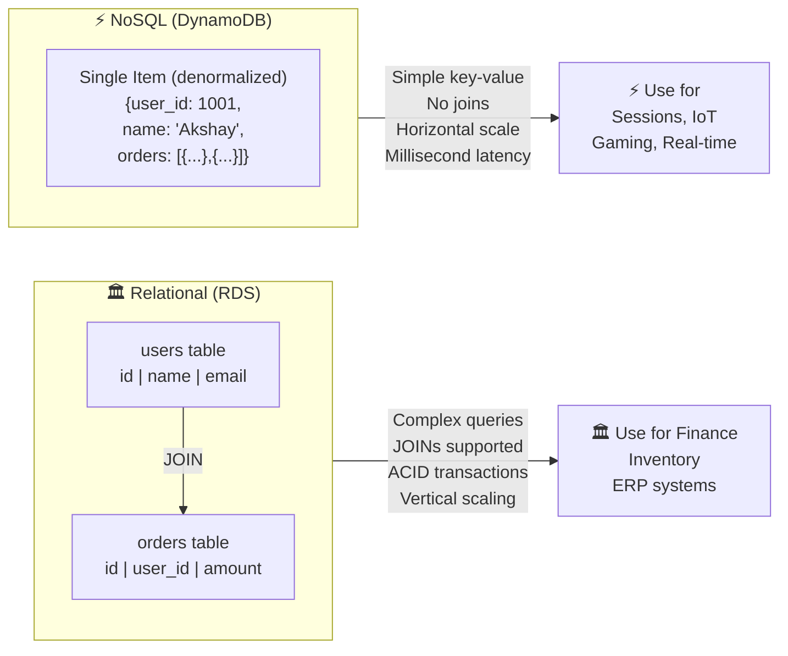

### DynamoDB Data Retrieval — 3 Methods

```
Primary Key Types:
━━━━━━━━━━━━━━━━━━━━━━━━━━━━━━━━━━━━━━━━━━━━━
  Simple:    PK = user_id (partition key only)
  Composite: PK = user_id + SK = order_id

Example Table (E-commerce):
┌────────────┬──────────┬──────────┬─────────┐
│ user_id(PK)│order_id  │  amount  │  date   │
│            │  (SK)    │          │         │
├────────────┼──────────┼──────────┼─────────┤
│   1001     │ order_1  │  ₹500    │ Jan 01  │
│   1001     │ order_2  │  ₹300    │ Jan 03  │
│   1001     │ order_3  │  ₹750    │ Jan 05  │
│   1002     │ order_1  │  ₹200    │ Jan 02  │
└────────────┴──────────┴──────────┴─────────┘

Method 1: GetItem    → PK=1001, SK=order_1  → O(1) ⚡ Single exact item
Method 2: Query      → PK=1001             → Returns ALL orders for user 1001
          Query+SK   → PK=1001, SK BETWEEN order_1 AND order_3
Method 3: Scan       → FULL table read ⚠️  → Never use in production!
```

**Design Principle:** Always design access patterns FIRST, then choose PK/SK!

```
Bad PK:  country = "India"  → Hot partition (millions in same bucket) ❌
Good PK: user_id            → Evenly distributed across partitions ✅
```

---

## 🔍 10 · Troubleshooting Scenarios

### EC2 Instance Terminated Unexpectedly

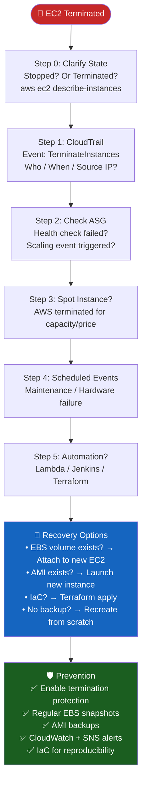

> 💡 **Interview Gold:** `CloudTrail = WHO · CloudWatch = WHY · ASG = WHAT happened automatically`

---

### EC2 Cannot Connect to RDS MySQL

```
Debug Order (Most → Least Common):

1. Security Group (80% of issues!)
   RDS SG inbound: Allow 3306 from EC2-SG (NOT from IP!)
   ❌ Wrong: Allow 3306 from 10.0.1.5
   ✅ Right: Allow 3306 from sg-xxxxxxxx (EC2 security group)

2. Same VPC Check
   EC2 and RDS must be in the SAME VPC
   aws ec2 describe-instances → check VPC ID
   aws rds describe-db-instances → check VPC ID

3. NACL Rules
   Allow TCP 3306 inbound to DB subnet
   Allow TCP 1024-65535 outbound (ephemeral)

4. Credentials
   mysql -h <RDS-ENDPOINT> -u admin -p
   ERROR: Access denied → Wrong username/password

5. DNS
   nslookup <RDS-ENDPOINT>
   If fails: Enable VPC DNS (enableDnsSupport + enableDnsHostnames)
```

---

### Developer Deleted S3/RDS/EC2 — Recovery Plan

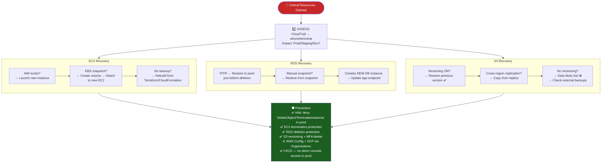

---

### Docker Container Exits Immediately

```
Diagnose:
  docker ps -a
  docker logs <container_id>
  docker inspect <id> --format='{{.State.ExitCode}}'

Exit Code Reference:
  0   → Completed normally (process ended — expected)
  1   → App crash / unhandled error
  137 → Killed: OOM (Out of Memory) or docker stop (SIGKILL)
  143 → Graceful stop (SIGTERM)

Common Fixes:
  ❌ CMD service nginx start        # daemonizes → PID 1 exits → container dies
  ✅ CMD ["nginx", "-g", "daemon off;"]  # foreground process → container stays alive

  ❌ ENTRYPOINT "/start.sh"          # shell form, /bin/sh = PID 1
  ✅ ENTRYPOINT ["/start.sh"]        # exec form, your script = PID 1

Debug override:
  docker run -it --entrypoint /bin/sh myimage  # force shell to debug

💡 Golden Rule: Container lives/dies with PID 1. Keep it in FOREGROUND!
```

---

## 💰 11 · AWS Cost Optimization

### Cost Optimization Framework

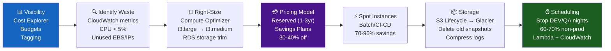

### Savings by Strategy

| Strategy | Tool | Typical Savings |
|:---|:---|:---:|
| Remove idle resources (CPU < 5%) | CloudWatch + Cost Explorer | **10–15%** |
| Right-size instances | AWS Compute Optimizer | **15–20%** |
| Reserved Instances / Savings Plans | AWS Savings Plans | **30–40%** |
| S3 Lifecycle → Glacier | S3 Lifecycle Policies | **20–30%** |
| Stop non-prod nights + weekends | Lambda + CloudWatch Events | **60–70%** |
| Spot for batch / CI/CD | EC2 Spot Fleet | **70–90%** |
| VPC Endpoints (skip NAT cost) | AWS PrivateLink | Variable |
| Graviton (ARM) instances | EC2 Graviton | **20–40%** |

### Tagging Strategy — Governance Foundation

```yaml
# Always tag every resource:
Environment: Production | Staging | Dev
Team:        DevOps | Platform | Payments | Data
Owner:       akshay.sawant@company.com
Project:     ecommerce-v2 | internal-tools
CostCenter:  CC-001

# Result: Cost Explorer → filter by tag → see exact cost per team/project
```

---

## 🎯 12 · Interview Cheat Sheet

<details>
<summary>💬 Q: "What happens when you type a URL?" — Perfect Answer</summary>

> "DNS resolution converts the domain to an IP via recursive resolver → root → TLD → authoritative DNS. Then a TCP 3-way handshake establishes a connection. If HTTPS, a TLS handshake encrypts the session. The browser sends an HTTP GET request, which hits the load balancer, routes to a backend server, which queries databases or cache, and returns an HTTP response. The browser renders HTML/CSS/JS and shows the page."

</details>

<details>
<summary>💬 Q: "Multi-AZ vs Read Replicas?" — Perfect Answer</summary>

> "Multi-AZ is for **high availability** — synchronous replication to a standby in another AZ with automatic failover. The standby does NOT serve reads. Read Replicas are for **performance scaling** — asynchronous replication to read-only copies that offload read traffic. Read Replicas can serve reads, have replication lag, and require manual promotion if primary fails."

</details>

<details>
<summary>💬 Q: "How does NAT Gateway work?" — Perfect Answer</summary>

> "NAT Gateway performs SNAT — it translates private IPs of instances in private subnets to a public Elastic IP. It maintains a state table to track connections so return traffic is routed back to the originating private instance. It only allows outbound-initiated connections — unsolicited inbound traffic is blocked. It's placed in a public subnet, and private subnets route 0.0.0.0/0 to it."

</details>

<details>
<summary>💬 Q: "SG Referencing — how does it work?" — Perfect Answer</summary>

> "Instead of allowing traffic from a specific IP, I reference another Security Group as the source. AWS checks whether the incoming packet's source ENI has that SG attached. This is dynamic — when Auto Scaling adds new instances to that SG, they're automatically allowed without any rule changes. IP-based rules break when instances restart and get new IPs."

</details>

<details>
<summary>💬 Q: "Explain PITR in RDS?" — Perfect Answer</summary>

> "Point-in-Time Recovery allows restoring a database to any specific second within a retention window (1–35 days). It works by combining daily automated snapshots with continuous transaction logs. In case of accidental data deletion, we can restore the DB to just before the incident occurred. It creates a new DB instance — the original is not overwritten."

</details>

<details>
<summary>💬 Q: "RDS Encryption — what are the constraints?" — Perfect Answer</summary>

> "RDS uses KMS for encryption at rest (AES-256) and SSL/TLS for encryption in transit. The critical constraint is that encryption must be enabled at DB creation time — you cannot encrypt an existing unencrypted database directly. The workaround is: take a snapshot → copy the snapshot with encryption enabled → restore a new encrypted DB instance."

</details>

### ⚡ Key Commands Reference

```bash
# EC2 Troubleshooting
aws ec2 describe-instances --instance-ids i-xxxxx
docker logs <container_id>
docker inspect <id> --format='{{.State.ExitCode}}'

# RDS
aws rds modify-db-instance --db-instance-identifier mydb \
    --allocated-storage 200 --apply-immediately
mysql -h <RDS-ENDPOINT> -u admin -p
nc -zv <RDS-ENDPOINT> 3306

# VPC / Networking
nslookup <RDS-ENDPOINT>
telnet example.com 443
traceroute example.com
openssl s_client -connect example.com:443

# Network Debug
netstat -tulnp | grep 80
ss -t
curl -I https://example.com
```

---

<div align="center">

## 👨‍💻 About the Author


**Akshay Sawant**
AWS DevOps Engineer | AWS Solutions Architect Associate
📍 Pune, Maharashtra, India

[](#)
[](#)
[](#)
[](#)

---

⭐ **If these notes helped you, please give this repo a star!** ⭐

*Part of the AWS & DevOps Learning Series*
*Also check out: 🐳 [Docker Mastery Notes](../docker/README.md)*

</div>


